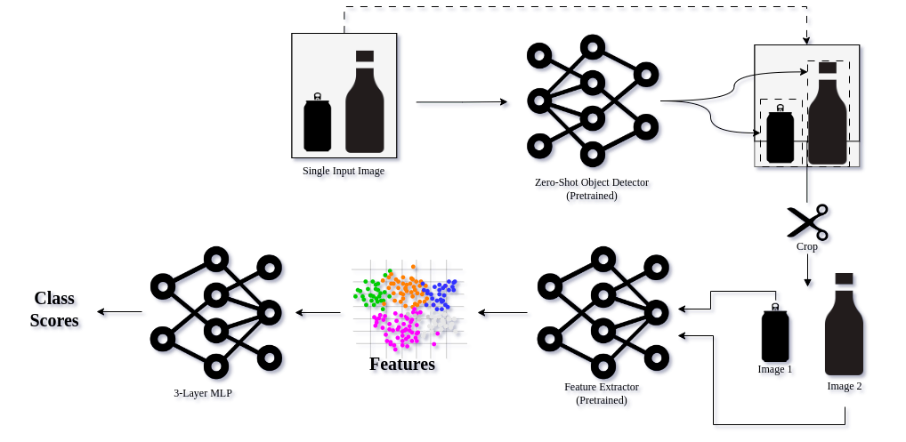

## Description

Repository for solving the AI enabled Automatic Recycling challenge @ViennaUP 2023

### Inference Pipeline

### 

First, a pre-trained zero-shot object detector (OWL-ViT) finds the bounding boxes. Each box is cropped and passed as a separate image tensor to a pre-trained feature detector (CLIP ConvNeXt-base). Finally, the features are passed to an ad-hoc trained lightweight MLP.

The users are presented with suggested labels, and are informed when the confidence of correct classification is low. Then, it is possible to define a custom label with which the MLP is trained. Re-training the MLP is fast even (at most a couple of seconds) on constrained devices due to its minimal size (~1000 parameters).

In a sense, the pipeline becomes a domain-adaptive online learner but has a solid foundation with powerful and efficient (subsecond inference times on server-grade hardware) models. The pre-trained models do not need to be finetuned at any point.

## TechStack (All open source)

- Python
- Flask
- VueJS
- Huggingface
- PyTorch

## References

- Wightman, R., PyTorch image models (2019). *DOI: https://doi. org/10.5281/zenodo*, *4414861*.
- Minderer, M., Gritsenko, A., Stone,  A., Neumann, M., Weissenborn, D., Dosovitskiy, A., Mahendran, A., Arnab, A., Dehghani, M., Shen, Z. and Wang, X., 2022. Simple open-vocabulary  object detection with vision transformers. *arXiv preprint arXiv:2205.06230*.
- Liu, Z., Mao, H., Wu, C.Y., Feichtenhofer, C., Darrell, T. and Xie, S., 2022. A convnet for the 2020s. In *Proceedings of the IEEE/CVF Conference on Computer Vision and Pattern Recognition* (pp. 11976-11986).
- Radford, A., Kim, J.W., Hallacy, C.,  Ramesh, A., Goh, G., Agarwal, S., Sastry, G., Askell, A., Mishkin, P.,  Clark, J. and Krueger, G., 2021, July. Learning transferable visual  models from natural language supervision. In *International conference on machine learning* (pp. 8748-8763). PMLR.

